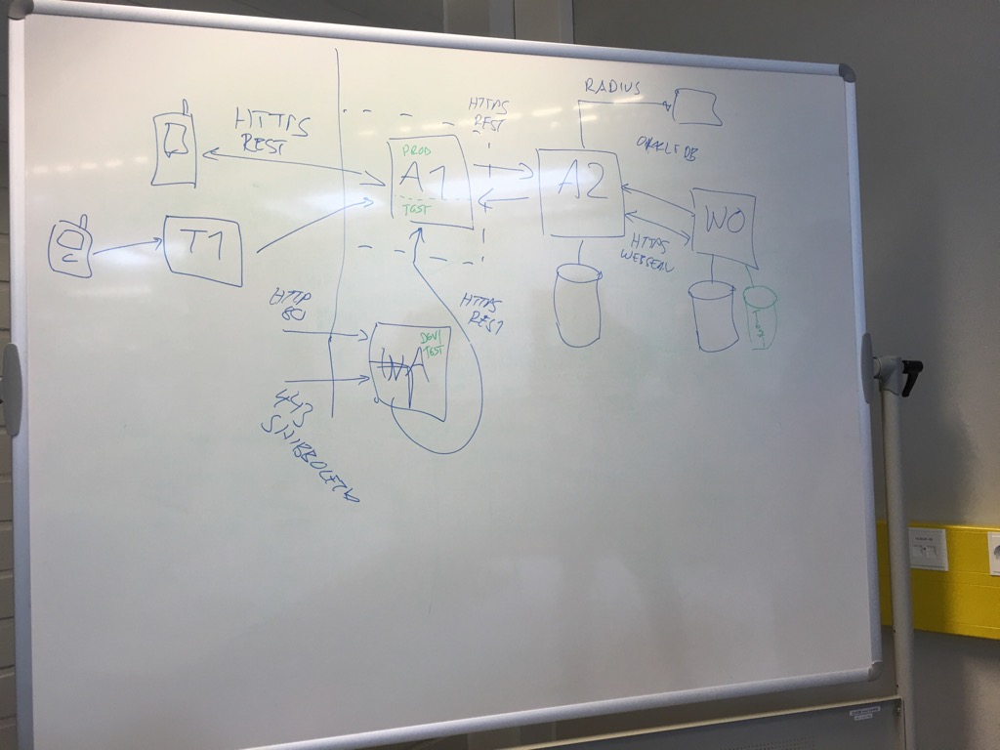

# aapo-audit
Aapo as a case study for audit ponderings

# Background

[University of Oulu](http://www.oulu.fi/yliopisto/) and
[Futurice](http://futurice.com/) are jointly developing Aapo 2.0 mobile
application for students. Aapo 2.0 is continuation for
[Aapo](https://aapo.oulu.fi/).

[OUSPG Open](https://github.com/ouspg/ouspg-open), in the spirit of
the [Google Summer of Code](https://developers.google.com/open-source/gsoc/),
provides summer activities for people interested in Information Security.

Aapo is used as an subject for open & educative security audit.

# 2016-06-14 - Kick-off

Jani Kenttälä (@janike) and Marko Laakso (@ikisusi) had a initial kick off
meeting with the current [Aapo](http://www.oulu.fi/yliopisto/node/37547)
project team about an educational security audit. We plan to take two
hackathon type sessions during the summer on auditing Aapo in open and
educational fashion with help from invited external experts.

In the kick-off meeting Jani and Marko got
a background briefing on the orignal and new Aapo and good past and future
work around it by the [Caleidon Team](http://www.caleidon.fi/en/) and their Tuudo.

Aapo is the second critical service right after Oodi for prodiving student services.
Neither students records nor personal device should be exposesdto any extra risk
due to Aapo.

Ari Vaulo drew as the overall architecture of the past, present and future (Aapo).

Ari goes through of some good design principles already applied and
some concerns identified by the makers themseles:

 * Identity is locked on the auth, no way to post-auth masquerade :)
 * A2 fetches bus timetables and restaurant menus from external world
 and they get presented in the Aapo itself. :(
 * Authentication tokens (user & password) considered most critical.
 * Concerned about the Web Aapo and directories in that service.

We agree to continue with more technical analysis with help of Katakri next
time.

# 2016-06-21 - Katakri

We did a dive into security of the Aapo with help of [Katakri](http://formin.fi/public/default.aspx?contentid=328713&contentlan=2&culture=en-US).

Battle hardened auditors Mikko Kenttälä (@Turmi0) and Mika Seppänen (@mseppanen) of [Synopsys](http://www.codenomicon.com/) visited us to workshop with us and walk us through Katakri in practice.

Aapo project team was represented by Laura Saukko, Kaarlo Määttä, Matti Suuronen and Ari Vaulo of University of Oulu and Hannu-Pekka Heinäjärvi of [Futurice](http://futurice.com).

Diagrams were (re)drawn and [detailed notes](notes-katakri.md) were kept.

*Click the image above to watch a timelapse from the technical discovery session.*

# 2016-08-09 - Hands-on

[Coming up in OUSPG open](https://github.com/ouspg/ouspg-open)
