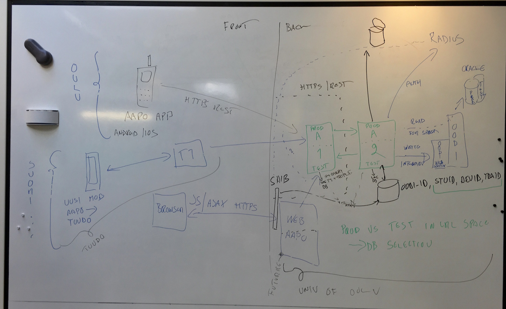

Quick notes from the interview by @Turmi0, @mseppanen and @janikenttala.

# Study Notes

## People & Orgs

* [Synopsys](http://www.codenomicon.com/)
 * Mikko Kenttälä (@Turmi0)
 * Mika Seppänen (@mseppanen)
* University of Oulu - backend & Aapo 1.0 frontend
 * Ari Vaulo,
 * Laura Saukko,
 * Kaarlo Määttä,
 * Matti Suuronen, and
* Futurice - Aapo 2.0 frontend development & old web aapo.
 * Hannu-Pekka Heinäjärvi
* Visiting stars:
 * G-BOA (Grand bearded OUSPG Alumni) Erno Kuusela of [Solita](http://www.solita.fi)
 * Ari Kauppi (@kauppi) of Ericsson
 * Jesse Hulkko (jhulkko) with [Kapsi](https://www.kapsi.fi) hat
 * Jani Huhtala (zaux) with [Kapsi](https://www.kapsi.fi) hat

## Technical Artefacts

 * ORACLE - DB serving OODI
 * [OODI](http://www.oulu.fi/oodi/)  - ''Oulun yliopiston yliopiston opetus- ja opiskelutoimintojen tukemiseen tarkoitettu tietojärjestelmä''
 * A2 - Adaptor/Front for OODI & Oracle Web Security. Removes the need to expose OODI-ID.
 * A1 - Public-facing front / API towards the Internet. Input normalisation.
 * Web Aapo - old web interface
 * T1 - Aapo 2.0 proxy for all universities
 * Aapo App - Aapo 1.0 mobile apps (iOS and Android)
 * Uusi mob Aapo - Aapo 2.0 mobile apps

# Main things to protect

 * Student information
 * User's terminals - do not lower the security of users endpoints. (E.g. we should not push software to students that endangers their equipment)

# Random notes.

* direct db access due to need for speed. :)  
* production and testing separated in URL-space

 * Android & IOS do not share code. Different programming languates + independent work.

 * Small differences in the API the browser uses.

 * The role of T1 - several univs using Tuudo - T1 maps traffic to Oulu Univ server.

 * Old Web Aapo done by Futurice

 * Koulutuspalvelut (Katja Kura) takes over once the system "has been tested"

 * Two things to protect
  * Student information
  * Student security shall not be jeopardised. (E.g. we should not push software to students that endangers their equipment).

# Some flows

## Session start via mobile

  * session can stay active for months

   * Supply user and pass
   * Check from Radius, is OK?
   * A2 gets ok -> check <person id> (= <oodi-id>) from Oracle
   * A2 stores {<oodi-id>, <student id>, <device id>, <transaction id>}
     * <student id> is generated by A2 and given towards the terminal.
     * <oodi-id> may have N <student id>s
    *  A2 uses local mysql db for storing the data

## Session start via webaapo
 * Supply user and pass
 * Shibboleth Checks the U&P against the same RADIUS
 * After success, shibboleth stops blocking the URL-space
 * (Shibboleth consumes the u&p in front of the app, the app should not get it. )
 * (Shibboleth then enters a session to the A2 local mysql db (feature compatibility with radius auth))
 * Shibboleth stores <eppn> + pseudo random number -> which is provided to Web Aapo

## Signup for course

No notes

## Fetch menus

Initiated two times per day from CRON. Aapo fetches the data and normalizes it for consumption.

# (Pseudo-Random) Notes from a KATAKRI-assisted interview session.

 * A1 & A2 use centralised logging -> ip+query+ts+”auth” triple. <- incorrect, this was not centralised after all. Logged to the server’s
 * “Onko verkkoarkkitehtuuri turvallinen”
  * Oodi web services -> no auth -> IP spoofing might be possible
 * Management
  * via SSH (so yes, encrypted)
  * SSH keys. Personal Accounts

 * Network EQ -  not in the hands of this crew.
 * Network segmentation - no (confirmed) network segmentation, albeit runs in virtualised environment, which might introduce some L2 perks.
 * However, tight policies in host-based firewalls
 * A1 and A2 act as a separator vs Oodi & Oracle

 * Resussien käytön valvonta
    *  ATK-keskus monitors  FW and observe logs.
    * Developers do observe logs, they  easily told anecdotes about usage stats etc

Onko huolehdittu, että organisaatiolla on toimintaansa nähden riittävät jatkuvuuden varmistavat suunnitelmat? Testataanko toipumisvalmiutta säännöllisesti? Turvataanko suojattavat tiedot myös hätätilanteissa?

 * Tieto on keskittynyt yhdelle henkilölle
 * Toipusmisvalmiutta ei testasta

Ovatko kehitys-/testaus- ja tuotantojärjestelmät erilliset?

 * Ei, mutta tietokannat ovat erit

Miten varmistetaan, että verkossa ja sen palveluissa ei ole tunnettuja haavoittuvuuksia? Onko tietoturvatiedotteiden seuranta vastuutettu? Onko turvapäivitysten asentamiseen luotu menettelytavat? Valvotaanko niiden toteutumista?

 * Kyllä
Onko riittävästä varmuuskopioinnista huolehdittu?

 * Kyllä

## Upsides:
 A1 + A2 development and policy management is closeby (same person), less mistakes with firewall rules

## Immediate recommendations:
 * Separate log server highly recommended to ensure integrity of logs
 * Tarkasta käytössä olevat salaukset
 * Rekisteriselosteen linkki viittaa HTTP-puolelle joka ei toimi

# Tietoturvasuunnitteluperiaatteet

Good ones already applies - Ari promised to commit those here as well

# Some reflections from Marko

 * Pair audits (like pair programming)
 * Sibboleth auth parannus (kuka on juuri kirjautumassa), käyttäjän lukitseminen)
 * Koulutuspalvelut Katja Pura
 * Vastuu siitä että opiskelijan tiedot/oikeusturva tai tietojen käsittelyn turvallisuus ei vaarannu
 * Kolmessa tunnissa Kataktri käytävissä läpi
  * Hyökkääjän näkökulma?
  * Mistä tietotulee ja mihin menee?
  * Mikä on todellinen suojattava asia (beyond tech artifacts)?
  * Zaux: Katakri yrittää puuttua kokonaisuuteen vs. käytännössä rajatussa tapaukessa tulee paljon annettuna
  * Jesse: Kataktri 3:ssa hyvä runko -> siitä rakentaa kysymykset softaprojektille
   * Auditoijan asiantuntemus auttaa mäppäämään
  * Checklist softan auditointiprojektille itselleen
 * ...
