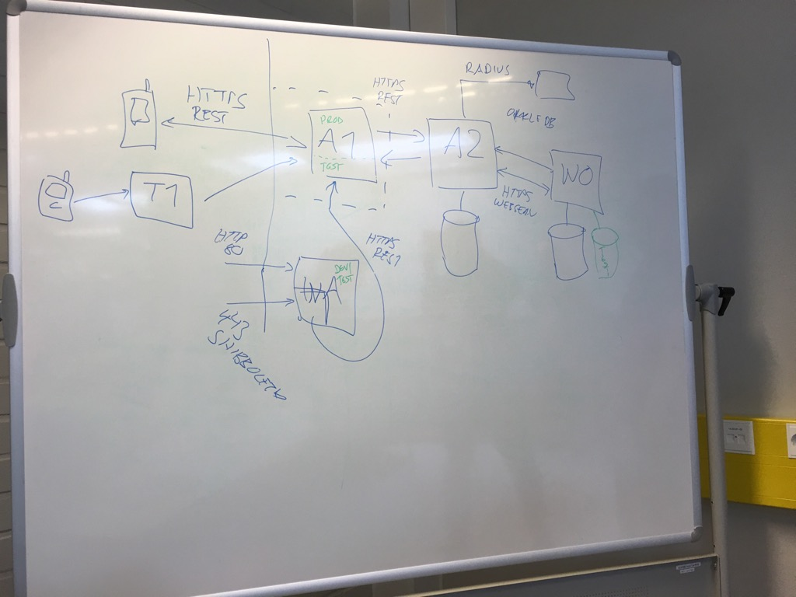

# 2016-06-14 - Kick-off Session

Jani Kenttälä (@evilon) and Marko Laakso (@ikisusi) had a initial kick off meeting with the current [Aapo](http://www.oulu.fi/yliopisto/node/37547)
project team about an educational security audit. We plan to take two
hackathon type sessions during the summer on auditing Aapo in open and
educational fashion with help from invited external experts.

In the kick-off meeting Jani and Marko got
a background briefing on the orignal and new Aapo and good past and future
work around it by the [Caleidon Team](http://www.caleidon.fi/en/) and their Tuudo.

Aapo is the second critical service right after Oodi for prodiving student services.
Neither students records nor personal device should be exposesdto any extra risk
due to Aapo.

Ari Vaulo drew as the overall architecture of the past, present and future (Aapo).

Ari goes through of some good design principles already applied and
some concerns identified by the makers themseles:

* Identity is locked on the auth, no way to post-auth masquerade :)
* A2 fetches bus timetables and restaurant menus from external world
 and they get presented in the Aapo itself. :(
* Authentication tokens (user & password) considered most critical.
* Concerned about the Web Aapo and directories in that service.

We agreed to continue with more technical analysis with help of Katakri next
time.
